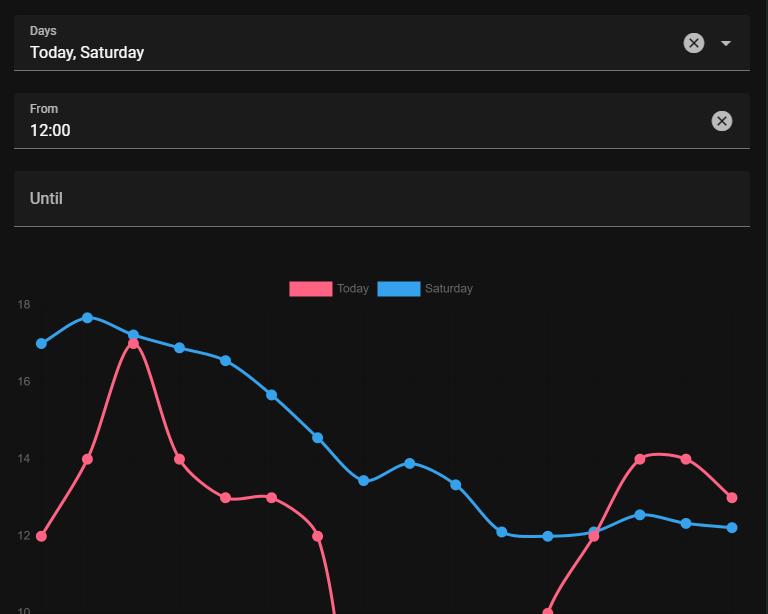

# Gym Visitor Stats



[Link to the app](https://gym.marceljacek.me)

This web app tracks the trend of visitors at a gym and compares it with historical averages for different days of the week.

<br>

## Backend

The backend fetches the current number of visitors in the gym from an API at 15-minute intervals. It then stores this data, along with a timestamp, in a SQLite database and calculates the average for the corresponding weekday. There are two tables in the database for this purpose.

### History Table

The first table, named "history," stores a timestamp and the number of visitors present at that specific time. The timestamp is formatted as "2024/03/25, 16:30" allowing you to see the exact number of visitors at any given moment. This data will be used to obtain the values for the current day and, while not currently utilized for other purposes, may be useful for future features.

### Stats Table

The second table, called "stats," contains three columns: a timestamp, the number of visitors at that time, and a "weight" value. The timestamp is formatted as "Monday, 16:30," representing an average for that weekday and time, rather than a specific date. To streamline updates without reloading all entries for the same weekday and time, a weight value is included. This weight indicates the number of entries used to calculate the current average, helping to maintain an accurate running average.

### API

The API for this service is straightforward. To retrieve data, you simply send a GET request with the weekday in the path, such as "/monday," and you'll receive a JSON array with the corresponding values.

``` JSON
  [
    {
        "timestamp": "Monday, 00:00",
        "value": 4.642857142857143
    },
    {
        "timestamp": "Monday, 00:15",
        "value": 3.642857142857143
    },
    ...
    {
        "timestamp": "Monday, 12:30",
        "value": 3.2857142857142856
    }
  ]
```

To get the values for the current day, you send a GET request with "today" in the path, and you'll receive a JSON array with the current day's values.

<br>

## Frontend

The frontend is built with Vue.js, Vuetify, and Chart.js to generate the graph. It is relatively simple to use. In the first dropdown, you can select the dates to be displayed, and in the text fields below, you can set a time range to specify the data shown in the graph. The relevant part of the frontend can be found [here](https://github.com/marceljk/gym-tracker-web/blob/d4fc2d2d5f853ea1c7eedbd3d179ba1ff39e0d5c/frontend/src/components/MainView.vue).
